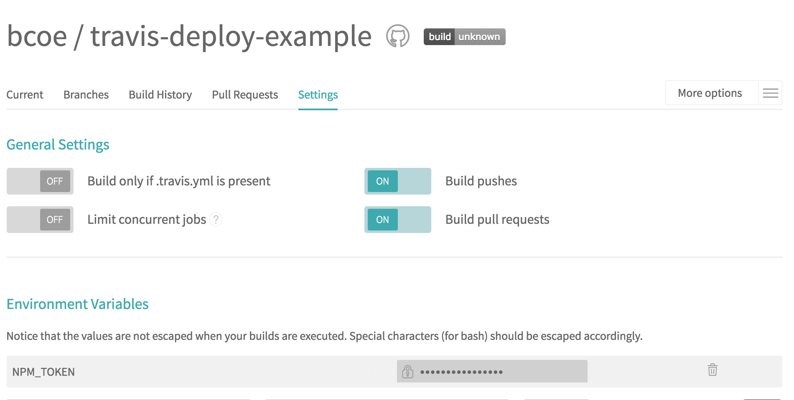

# Travis Deploy Example

Example of using Travis CI to automatically publish your packages to npm, using:

* Travis CI's [npm deploy](https://docs.travis-ci.com/user/deployment/npm/) functionality.
* the [makeshift](https://github.com/nexdrew/makeshift) package, for generating an `.npmrc`
  file with your credentials in it.
* and the [standard-version](https://github.com/conventional-changelog/standard-version) package,
  for automating [semver](http://semver.org/) bumps and CHANGELOG generation.

## Setting `NPM_TOKEN` environment variable

To be able to install private packages and to publish on your behalf, Travis CI
needs your npm deploy token. After logging into npm, [this token can be found
in your `.npmrc` file](https://npme.npmjs.com/docs/workflow/travis.html#option-1-fetch-your-npm-enterprise-secret-token).

Once you fetch your token, set this as an environment variable in Travis CI called `NPM_TOKEN`:



## Installing Private npm Packages

`.npmrc` is npm's configuration file, amongst other things: it contains your auth information, and tells the npm
CLI what registry to install from. The following lines in our `.travis.yml` generate
an `.npmrc` [mapping the @bcoe scope](http://localhost:4000/cli/configuration.html#option-2-using-enterprise-for-private-packages-only) to the `registry.npmjs.org` registry:

```yaml
before_install:
  - npm i -g makeshift && makeshift -s @bcoe -r registry.npmjs.org
```

This allows us to install the private `@bcoe/super-secret-dependency` dependency.

## Automatically Publishing From Travis CI

The `.travis.yml` included in this repository automatically publishes to npm, if
tests pass for a [git tag](https://git-scm.com/book/en/v2/Git-Basics-Tagging) that you push to GitHub. Here
are the pertinent lines in the `.travis.yml` to support this:

```yaml
deploy:
  provider: npm
  email: ben@npmjs.com
  api_key: $NPM_TOKEN
  on:
    tags: true
```

That's all there is to it! note that it references the same `NPM_TOKEN` environment variable that
is used to install `@bcoe/super-secret-dependency`.

## Commit Format

Deciding on what version to bump your package is a hassle; _did I add a feature since I
last released, was it just patches?_ This demo uses [standard-version](https://github.com/conventional-changelog/standard-version) to solve this problem.

When making commits, simply follow these commit standards:

_patches:_

```sh
git commit -a -m "fix: fixed a bug in our parser"
```

_features:_

```sh
git commit -a -m "feat: we now have a parser \o/"
```

_breaking changes:_

```sh
git commit -a -m "feat: introduces a new parsing library
BREAKING CHANGE: new library does not support foo-construct"
```

_other changes:_

You decide, e.g., docs, chore, etc.

## Publishing Your Package From Travis CI

When you're ready to have Travis CI publish a new version of your package to npm:

* `npm run release`, this will look at your commit history, and use [standard-version](https://github.com/conventional-changelog/standard-version)
  to: bump the version #, create a tag, and update your CHANGELOG.
* `git push --follow-tags origin master`, this will push the tag up to GitHub
  and kick off a build on Travis CI which will publish your module once it succeeds.

That's all there is to it, it's _literally_ magic.

## Using npm Enterprise

To configure Travis CI's deploys to use your private [npm Enterprise](https://www.npmjs.com/enterprise)
server, only two configuration changes need to be made:

1. add a `publishConfig.registry` to your `package.json` that references your
   private registry:

  ```
  {
    "publishConfig": {
      "registry": "https://npmo-demo-registry.npmjs.com"
    }
  }
  ```

2. update the `makeshift` line in your `.travis.yml` to point to the new registry:

  ```yaml
  before_install:
    - npm i -g makeshift && makeshift -s @bcoe -r https://npmo-demo-registry.npmjs.com
  ```
